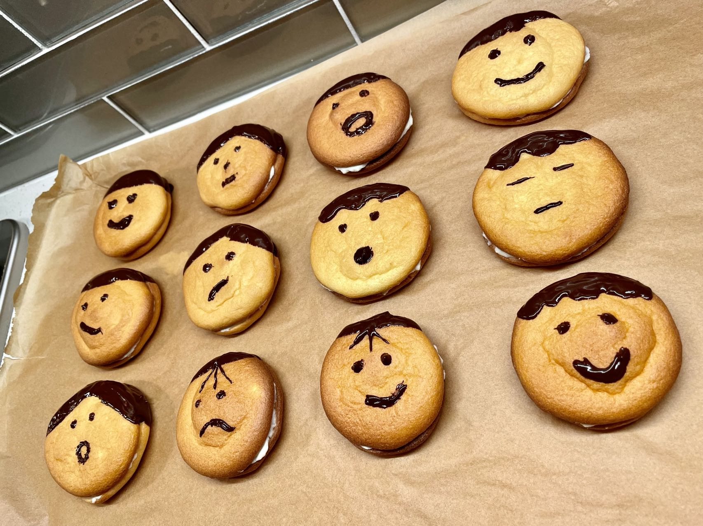

### This is Yishan Chen's Page

#### Personal Introduction

Hi! I'm Yishan Chen. I'm currently a second-year MPH student at the Columbia University Mailman School of Public Health with a Master of Public Health in Biostatistics and a Certificate in Epidemiology of Chronic Disease.

#### My Pet

I have a sweet male maltese called Rookie. He is 7 month old. 
Here's a picture of Rookie!

#### Hobbies

I love baking!

###### Here's a direct link to the resume page: [resume](resume.html)

###### Here's a direct link to the professional networks page: [professionalnetworks](professionalnetworks.html)

###### Here's a direct link to the plotly page: [plotly](plotly.html)